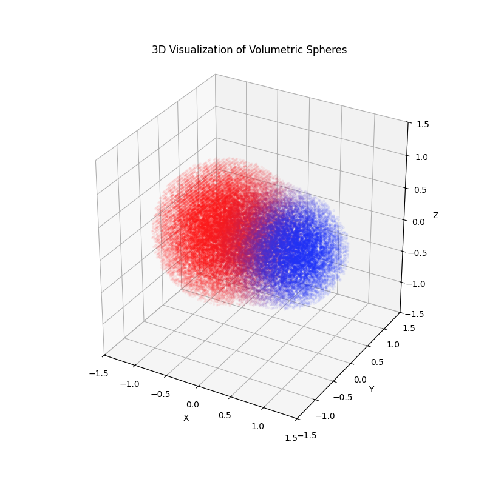
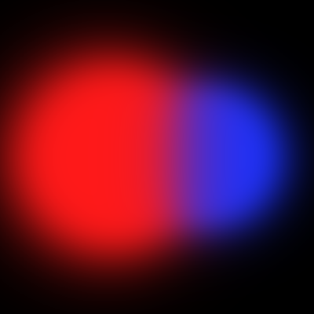

## Tiny Volume Renderer (from Scratch)

This is a minimal Python implementation of a volumetric renderer that generates 2D images by sending camera rays through a synthetic 3D density field. The renderer showcases two volumetric spheres and visualizes both a rendered image and the underlying density distribution.

---

### Project Structure

- **scene.py**: Defines sphere objects, density, and color in the 3D scene.
- **utils.py**: Ray and camera utility functions.
- **render.py**: Implements the core 2D volume rendering routines, including both fast and slow rendering.
- **main.py**: Entry point; runs the renderer, saves outputs, and shows visualizations.
- **visualize.py**: Produces a 3D scatter plot view of points with high density in the field.

---

### Usage

Run the project by executing the following in your terminal:

```bash
python main.py
```

This will generate images and save them in the current directory.

---

### Example Outputs

Rendered 2D and 3D visualizations:

- 
- 


